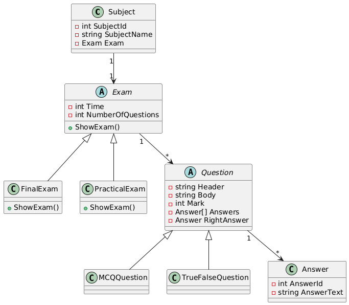

 # Examination System

## 📌 Overview
This project implements an **Examination System** in C#.  
It supports two types of exams (**Final** and **Practical**) with different question types (MCQ and True/False).  
The system also handles **Subjects**, **Questions**, and **Answers**, while applying **OOP principles** such as inheritance, polymorphism, and interfaces.

---

## 🏗️ Features
1. **Question Object**
   - Header (Title of the question)
   - Body (Content of the question)
   - Mark
   - List of possible answers
   - Correct answer

2. **Question Types**
   - **Final Exam**
     - True/False
     - MCQ (Choose one answer)
   - **Practical Exam**
     - MCQ only

3. **Answer Object**
   - `AnswerId`
   - `AnswerText`

4. **Exam Object**
   - Time of the exam
   - Number of questions
   - Shows exam differently depending on type:
     - **Final Exam:** Shows questions, answers, and grade.
     - **Practical Exam:** Shows right answer after finishing.

5. **Subject Object**
   - Subject ID
   - Subject Name
   - Associated Exam

---

## 🛠️ OOP Concepts Used
- **Inheritance** → Base `Question` class and derived types (MCQ, True/False).
- **Polymorphism** → `ShowExam()` method overridden for `FinalExam` and `PracticalExam`.
- **Interfaces** → Implemented `ICloneable`, `IComparable`.
- **Constructor Chaining** → To simplify object creation.
- **ToString Override** → To display objects as formatted text.

---

## ▶️ Example Flow
1. Create a `Subject` (e.g., "Math").
2. Assign an `Exam` (Final or Practical).
3. Add questions and answers.
4. Run the exam:
   - If **Practical**, display right answers after submission.
   - If **Final**, display grade and detailed report.

---

## 📂 Project Structure
```/ExaminationSystem
│
├── Models
│ ├── Question.cs
│ ├── MCQQuestion.cs
│ ├── TrueFalseQuestion.cs
│ ├── Answer.cs
│ ├── Exam.cs
│ ├── FinalExam.cs
│ ├── PracticalExam.cs
│ ├── Subject.cs
│
├── Program.cs
└── README.md
```
## 📊 UML Class Diagram


